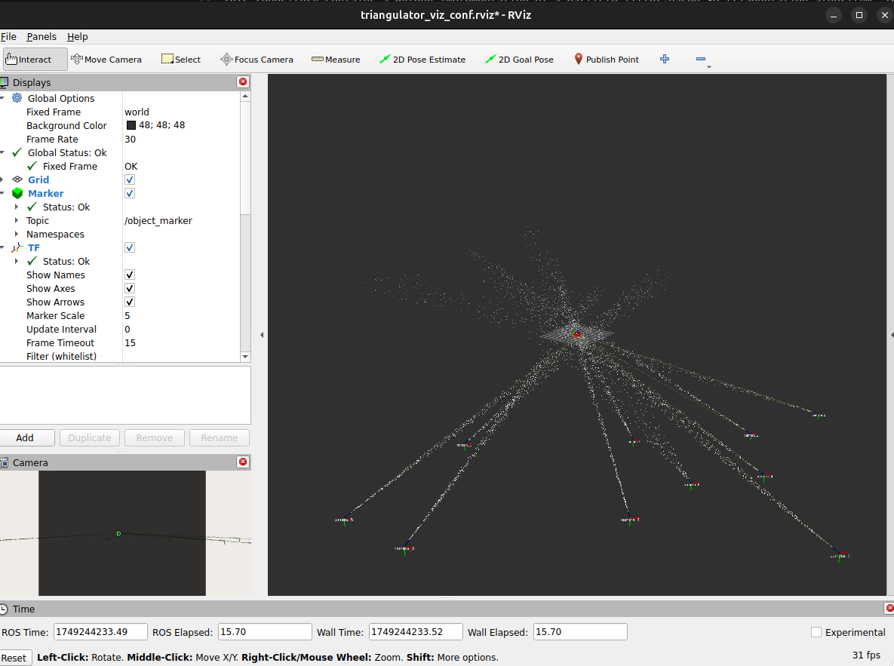
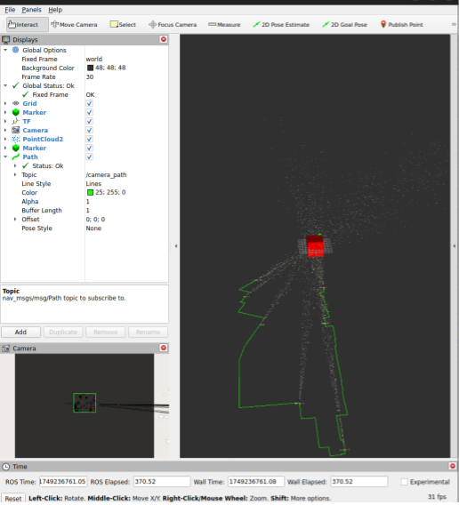

# Particle Filter based 3D Triangulation
This repository contains a Python implementation of a particle filter-based 3D triangulation algorithm. The code is designed to estimate the 3D position of a point in space using multiple 2D observations from different camera viewpoints.

## Usage
### Multi-Camera Triangulation
To visualize multi-camera triangulation, where each camera position is randomly generated, run in separate terminals:
```bash
ros2 run triangulation3d triangulation_visualizer
rviz2 -d rviz/triangulator_viz_conf.rviz
```
The `triangulation_visualizer` node will publish random camera positions and the object in space, along with the triangulated position and the particles projected form each camera which can be visualized in RViz. The RViz window will look like this:


### Single Camera Triangulation with Teleoperation
To teleoperate the camera and triangulate the detected object, run in separate terminals:
```bash
ros2 run triangulation3d teleop_triangulation
ros2 run triangulation3d teleop_twist_keyboard
rviz2 -d rviz/teleop_triangulator_viz_conf.rviz
```
In the terminal running `teleop_twist_keyboard`, use the following keys to control the camera:
- `w`: Move forward
- `s`: Move backward
- `a`: Move left
- `d`: Move right
- `q`: Move up
- `e`: Move down
- `p`: Pitch up
- `l`: Pitch down
- `o`: Roll right
- `k`: Roll left
- `i`: Yaw right
- `j`: Yaw left

Press `Ctrl+C` to stop the teleoperation. The rviz window looks like this:
